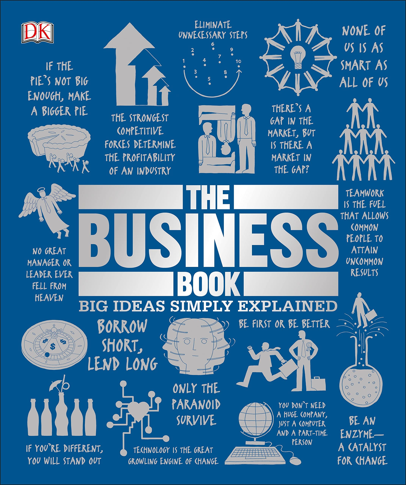
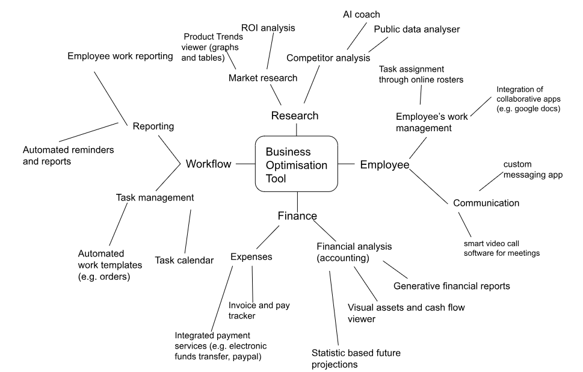
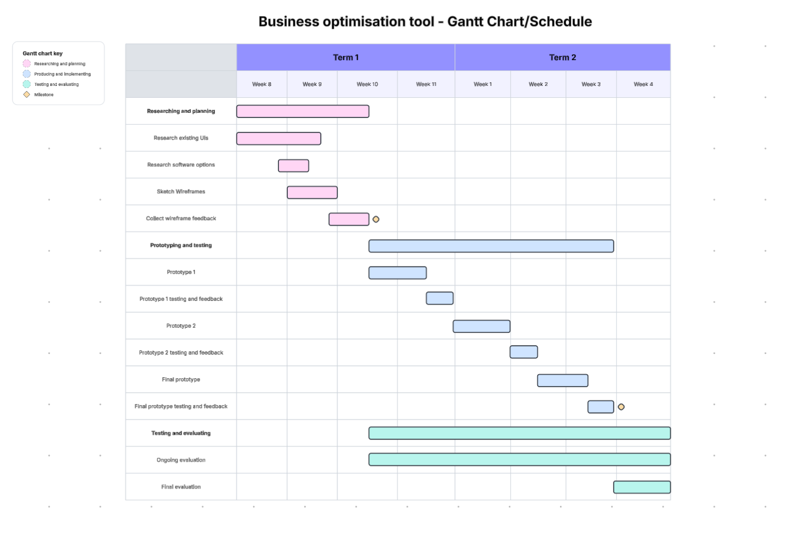
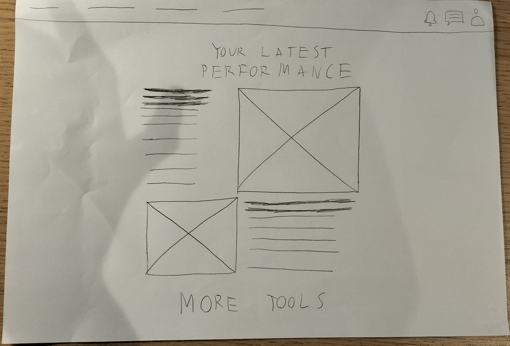
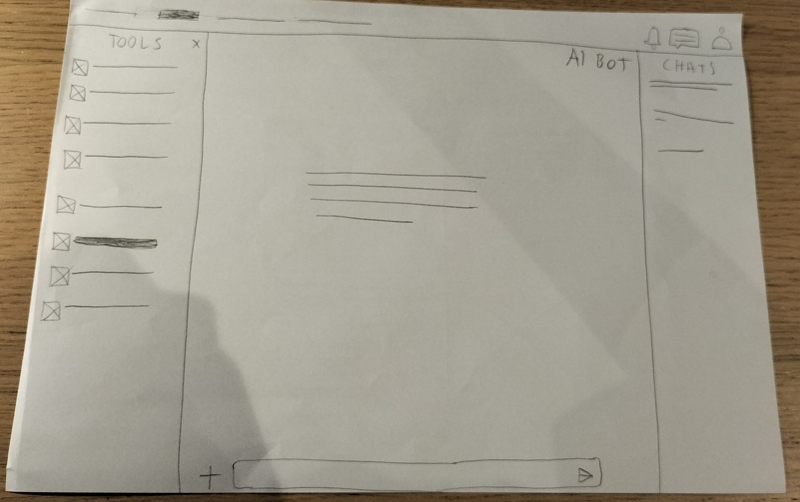
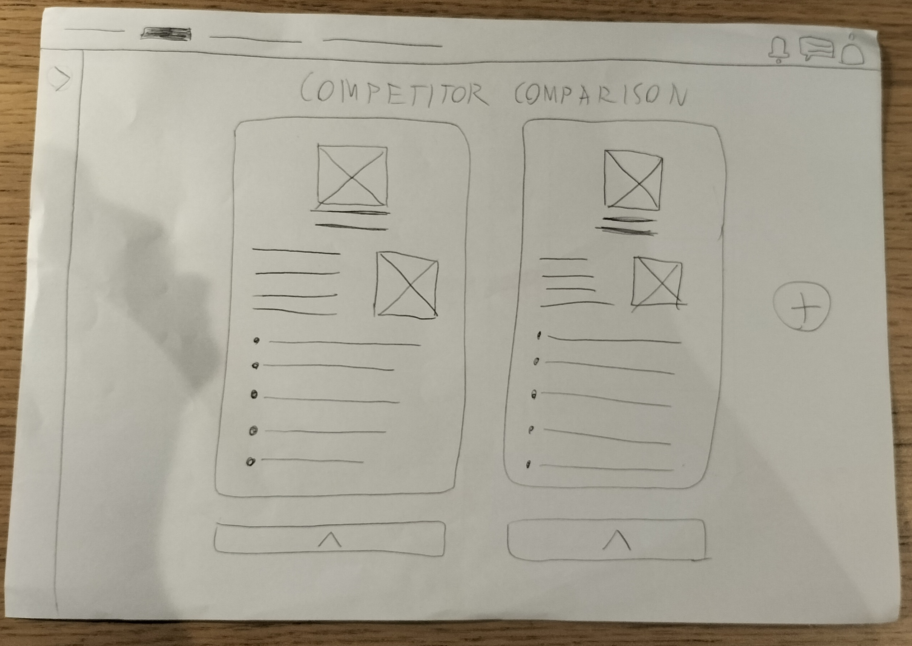
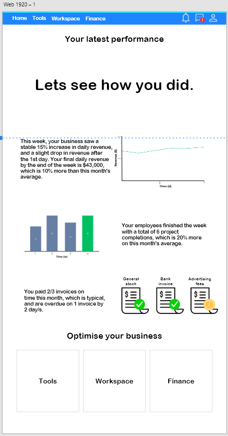
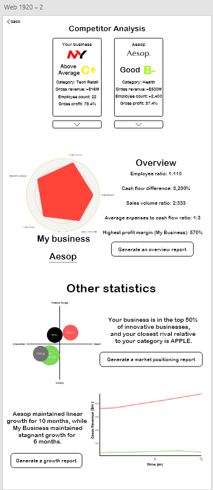
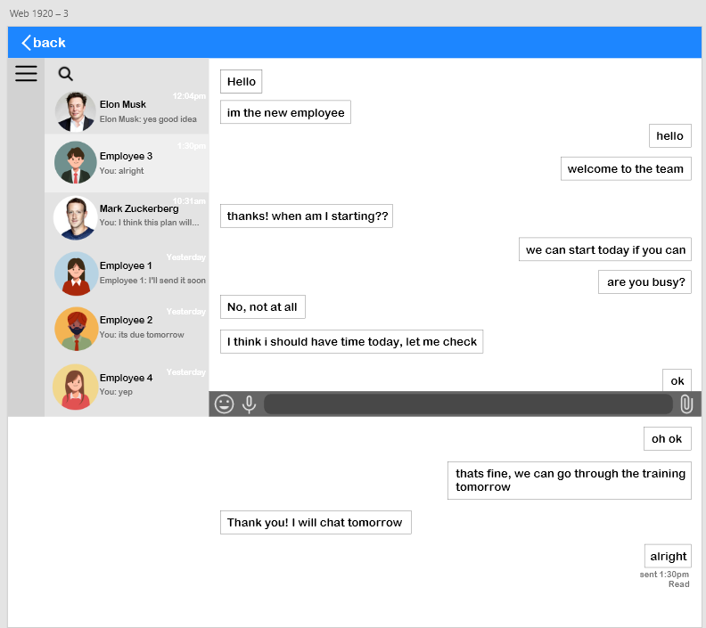
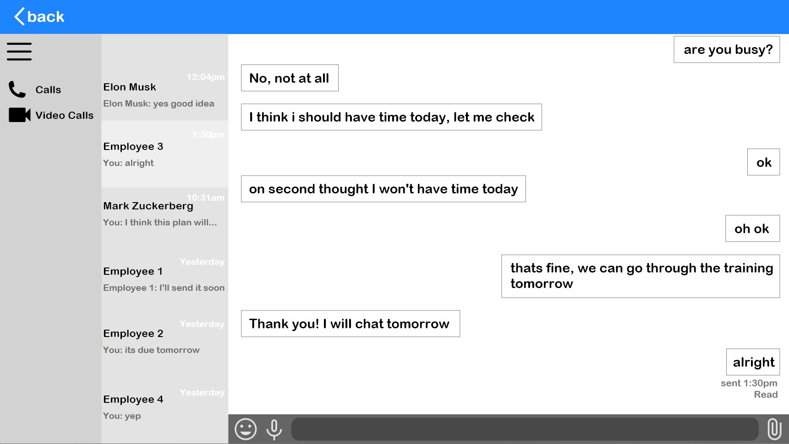

# **Assessment Task 1 - UX**

## **Project Proposal**

## Design Brief

### Type of User Experience: **App**

### What will the UX be about?

#### A general overview of this project is that it is an online business optimisation tool, which can be used by smaller start-ups or entrepreneurs to review performance and analytics of their business, and receive personalised feedback from the website itself.

### Target Audience

#### Generally, the target audience is for those who are new to entrepreneurship, beginning business or need a simple research or optimisation tool for their existing business, especially young people. Will be more optimised for those with smaller businesses.

## Book choice and justification

### Author: **Produced by DK (Dorling Kindersly)**

### Summary

#### The book is about how the world of business works and explores various concepts in simple detail. Each concept is explained with examples from the past and present. It includes key concepts such as business management, market research and business models. This book is especially useful in describing strategies for start-up businesses with real world examples.

### Why i chose this book

#### I chose this book because I have an interest in learning about how businesses run and what makes them successful. With the knowledge from the book, I am deciding to integrate it into the project, which will be designed to optimize and visualise the performance and analytics of a real business.

## User experience type

#### The project will be an app available for most devices. This format applies the already given information from the book into more broad tools (e.g. market analysis), extending the book’s theme onto a “real world” application that can be used in real business.

## Target market

#### The target audience will be people (especially those who are young adults or teenagers) who are currently running or thinking of running a business. This project will appeal to this target audience because of its optimised functionality towards newer entrepreneurs, and because of its beginner-friendly interface and value that it delivers to help people start and optimise their businesses. The design interface will be simple and easy to navigate, with plenty of visible icons, sections and tabs to help users navigate efficiently.

## Software and tools

#### The planned software used will be Adobe XD and Premiere Pro. Adobe XD will be used to design the prototype of the planned app and its preview of functionality (previewing a design), and Premiere Pro will be used to edit a video for a demo of the designed prototypes to set user expectations.

## Brainstorming

### Research - It will be especially useful as market research is generally a task that requires in-depth exploration.
### Employee - It will be fairly useful, but might be a feature early entrepreneurs will not require during the first stages of business.
### Finance - This will be a vital feature within the tool, as it helps avoid vigorous and timing consuming tasks that involve sorting and reporting finance.
### Workflow - This will generally have the least impact, but is a convenient built-in feature for workflow management. There may be other apps that are specifically built for workflow.

## Functional Requirements

### Purpose of the Application

#### The app's purpose is to assist and optimise an entrepeneur's business through a variety of different tools, including market research, finance management, and workflow automation to make the task of managing a business much more convenient. It is designed to engage the audience of the book 'The Business Book', and the app will apploy concepts from the book into its tools.

### Key interactions (use cases)

* #### VIewing market research - The user, from the home page, clicks onto one of the main sections (market), and selects 'view latest market trends'. The app will then display a graph or statistics related to the user's business' niche about product trends.
* #### Generating a financial report - The user, from the home page, clicks onto one of the main sections (reports), and selects 'Generate a financial report'. The app will then utilise AI and gather the user's business' data and generate the report.
* #### Employee Messaging - The user, from the employee section, clicks a chat icon from the top right of the nav bar. The app displays the current existing chats, and the user selects the required employee's online chat, to message them.
* #### AI Coach - The user, from the home page, clicks onto the 'AI Coach' icon on the bottom left of the screen. The app will then display the AI's prompt screen, waiting for user input. Once the user inputs their prompt and sends it, the AI will respond with a dedicated answer.

## Non-functional Requirements

### Performance

#### The app will be optimised as best as it can for all devices, and will minimise CPU usage as much as possible, so that the computer's resources aren't being overwhelmingly drained. Loading times between different pages will also be kept as small as possible (under 1 second), and gathering data from external sources (e.g. the internet) will be made to be as efficient as possible.

### Usability

#### The app will have a similar layout to a website (especially a navbar and the body), to make navigating around the app as easy as possible. Navigating to specific sections (e.g. invoice tracker) will be made easy by categorising them into much larger and broad sections (in this case, finance/accounting). The design of this app will also include both light and dark mode, adjusting to the user's visual preferences. The fonts used will be simple, the button styles kept easy to see, and font-sizes will be moderate-large sized, ensuring the user can access text in a timely and efficient manner.

### Reliability

#### In order to ensure the app will stay consistent, the app's layout will be optimised for each device (especially computer, mac and mobile), and screen sizes, font-sizes, and graphics will be optimised for each device. In addition, cross-platform will also be integrated, to ensure syncing between all devices for the user. Bugs will be regularly checked for, and public beta testing through fake profiles will also be open for people to test and report bugs.

### Security

#### There are a variety of different security concerns for the app. Some factors that need to be considered are login information (especially important since users will be running businesses from 2 figures all the way to 9 figures), which can be protected through secure databases and 2-factor authentication. The AI coach is also personalised for every user's business, so any chats stored will need to be kept confidential to ensure there are no data breaches, and the AI would not be able to be trained based on the confidential information given by users. Employee management systems would also need to be highly protected, to ensure there are no breaches of business employment systems. Lastly, and financial information and invoices will also need to be securely protected and kept confidential so no users will face significant financial losses from hackers.

## Social, Ethical and Legal Issues

### Social Impact

#### The **target audience** (young entrepeneurs) will be the main users of this app. **Accessibility** needs, such as text language, screen reader compatibility, and level of tech proficiency (considering how well the user is at using technology) will be taken into account for. The **benefits** of using this app encourages users to explore the topic of business, and makes it much easier for them to start, handle and make a profit from their business, as the app will include a variety of different tools, especially those that are data driven, enhancing decision making. However, there are also **potential risks**, involving over-reliance on data (users may be too reliant on given data to make decisions), and the app may cause the risk of job displacement (such as accounting or data jobs), although this risk may be at a small scale depending on how many users choose to adopt this app.

### Ethical Responsibilities

#### The app will **collect user data** through highly secure databases and collection methods to avoid potential breaches, as sensitive information (especially related to finance and banking) will be kept confidential. Only non-sensitive data will be collected, such as app use patterns, and data use will be minimilised and only collected to enhance the user experience. Data collection will also be kept transparent to users, so they know exactly what is being collected. Because of the book's non-fiction and, mostly, factual nature, many concepts from the book will be 'converted' into tools that will be integrated into the app, and will **fairly represent** these business-related concepts and themes, but will be made clear to users that there is no guarantee of financial, emotional or social benefit when using the tools, which were inspired from the book. The book **does not contain many controversial topics**, but wlll also be made clear to users that there will be no guarantee of benefits when applying the concepts from the book.

### Legal Considerations

#### In order to **avoid copyright violations**, any quotes, images and concepts from the book will be credited accordingly and appropiately. Original assets, such as graphics, will be created, but inspiration will be borrowed from the book's existing elements. In addition, a great number of **legal considerations** will need to be taken account for. These considerations comprise mostly of data privacy concerns, including the protection and storage of sensitive information from users (passwords, bank information, financial information), altered content (false information given by algorithm-driven AI), and the concept of truthful data (e.g. using valid sources for market research). These legal considerations are especially important as financial risk of using the app is likely when mismanaged.

## Researching and planning

### Gantt Chart

### Researching Existing UIs

#### **Google Trends**

| Plus | Minus | Implication |
|------|-------|-------------|
| The Google Trends site's layout is kept extremely simple, and the small amount of navbar options (3) makes accessing the site's features easy. The font is easy on the eyes, as well as the colours used, and employs a modern, minimalist appearance for the whole site to keep its themes consistent. The loading times between different pages is also very fast. | The site does not include any context on how it can be used, although it features a help section on the side navbar, where it leads to an external site for a guide. In addition, there is not a lot of customisability within the trends tools. This could be expanded, however with a wider variety of graph customisation, such as graph types and social media engagement. | In consideration of the Google Trend's minimalist, easy to navigate design, and opposing lack of customisation within trend-searching tools, I am moving forward with my project with the consideration to integrate easy-to-use market research tools, with full customisation options to adhere the users' needs.

#### **Notion**

| Plus | Minus | Implication |
|------|-------|-------------|
| The Notion App has a sleek, minimalist design that is easy on the eyes, and is packed with many accessible features for productivity. Its features such as notes, tables and schedules are packed in once place which reduces the need to switch between tools. It also integrates an online marketplace with design templates, making it more time efficient to optimise the user's efficiency. | While Notion is one of the best productivity apps, there is no 'official' in-depth guide within the app for new users to learn, so its learning curve can be quite steep. In addition, its simplistic interface might make it hard to manage larger projects (or databases), and requires a lot of sorting. | Considering that while its sleek design is attractive, and that there is no 'official' in-depth guide, I will consider adding an integrated, full guide to using my app, which will remain optional for users, but is optimal for new users. |

#### **Canva**

| PLus | Minus | Implication |
|------|-------|-------------|
| Canva's website features an easy-to-navigate and beginner friendly experience, with a simplistic design. It allows for collaboration between users for projects, and the website also comes with a large collection of templates for many different types of designs. The tools are easy to learn, and Canva also features a large collection of elements, like graphics, images and fonts, making it extremely convenient for users to get started from scratch. | While the website, as mentioned before, is beginner friendly, the tools it includes are not suitable for advanced users. For example, resizing elements can only expanded one way, but can't be stretched vertically or horizontally. In addition, it is not accessible offline, and requires an internet connection to use. | Considering that while Canva features a beginner friendly interface and tools, and that it lacks professional extensions of these tools, I will consider featuring both a beginner/normal mode and an advanced mode for my app's various tools, ensuring both beginners and experienced people can make the most out of the experience. |

### **Researching software options**

#### **Adobe XD**

| Plus | Minus | Implication |
|------|-------|-------------|
| Adobe XD is an app specific to creating User Experience designs, and is part of the Adobe ecosystem, and features a clean and somewhat easy to use interface. Importing assets, such as images, is also easy. In addition, since I have an education plan, I do not need to pay for any 'premium' services that it may offer. | While Adobe XD is a great fit for getting the most out of 'free' user experience apps, it should also be noted that it has been discontinued (meaning there aren't new updates), which may imply there could be bugs and errors within the app. In addition, since its discontinued, it means some of the features may be outdated. | From this information, while Adobe XD is outdated, it may be the best software option to craft my experience, since I already have the education plan. |

#### **Figma**

| Plus | Minus | Implication |
|------|-------|-------------|
| Figma is a popular user experience design app, and has a lot more advanced features. It also has great online compatibility, so finding resources and templates for the app will be much easier.  | While it has a lot more advanced features, it may be a lot harder to learn at first. In addition, there is a paid plan for more features. | After considering that while Figma had overall more up-to-date features, the fact that I cannot use the paid plan and that learning it might take too much time, I will have a low consideration to use the app. |

#### **Canva**

| Plus | Minus | Implication |
|------|-------|-------------|
| Canva is also a potententially useful app for UX design, as it features a beginner-friendly interface with thousands of templates, so the prototyping process can be done quiickly. It also has a relatively simple interface, so accessing the features will be made easy. | While it is a simple design tool, it lacks a lot of advanced features, especially in adjusting size of objects and elements. Furthermore, it is not specifically designed towards creating UX designs, and it may be ineffective to creating detailed prototypes. | Considering Canva's lack of UX specific designing features, and its lack of advanced features (e.g. scaling elements is only limited to overall size, not stretch), I won't consider choosing this software to design my user experience. |

#### 

### **Wireframes**

#### **Wireframe 1**

#### **Wireframe 2**

#### **Wireframe 3**

#### **Evaluation**

##### From the feedback that I have received, I have **learned** that space management is extremely important, as many of the responses collected were suggesting for less 'airy' spaces for layout 1. In addition, a concept known as 'eye movement' was introduced to me, and some particular responses suggested reorganising the chat sections specific to layout 2. Knowing this, I will apply this feedback to manage my space management in my upcoming and final prototypes.

## Producing and Implementing

### **Prototype 1**

#### Analysing some of the given feedback, some users have noticed that the information on the home screen looks a little bit packed together (too dense), or overcrowded. In addition, some users also stated that the yellow clock icon didn't seem to suggest them to take immediate action, as it is meant to represent an overdue invoice payment. On the other hand, most of the users said that the simplicity of the overall design worked well, making it easy on the eyes. Based on this feedback, the home screen overall met its minimum functionality requirements, but some visuals do need to be improved, but it can be safely determined to be user-friendly.
#### There was no other prototype at this time, to test load speeds, but the current prototype worked smoothly to all users. Regarding survey and interview trends, most of the given feedback was similar, especally in relation to space management issues, so that must be addressed when creating the final prototype. 
#### In conclusion, the main areas for improvement regarding this prototype is to address space management, visuals choices and perhaps some extra accessiblity features (such as a dark mode version for the final prototype).

### **Prototype 2**

#### Analysing some of the given feedback, some of the users, similarly to prototype 1, have stated that there is a potential information overload, especially in the 'other statistics' section. In addition, some of the users also noticed a gap of space in between the ends and the competitor analysis boxes, and they suggested it to be filled. On the other hand, the users also stated that the integration of interactable data was a great functional feature. and the customisable competitor analysis concept was also a good feature for the app. Based on the given feedback, this prototype has overall great functionality that fits the purpose of the app, and is fairly user-friendly and easy to use with the help of easily visible design elements.
#### The load speed between the current 2 prototypes is kept under 1 second, which meets the minimum requirement. Interactable features within the app are responsive, but sometimes lag behind. So overall, the app's responsivness and load times are kept at an acceptable level. As before, most of the responses were relatively consistent, where a lot of them mentioned about space management and information density.
#### In conclusion, the main areas of improvement is to address information density and reconsider design choices, and although it is a minor issue, it slightly worsens the user experience.

### **Prototype 3**

## Final Evaluation

#### Overall, this project was only a partial success in terms of reaching the planned requirements, especially non-functional ones. To start, the prototypes created have good performance, with minimal delays or loading times. The fonts were maintained to be easy to read, and buttons were easy to see. 3 examples were created (home screen, competitor analysis, messaging app), and while some of them weren't planned to be a test case, they still met their functional requirement of serving the user as a business optmisation tool. The entire design theme was kept simple as planned. However, plans regarding security were not brought into the prototypes, as they were mainly design related prototypes. 
#### The preferred audience that will be the main users was targeted successfully, as the prototypes met its functioanl requirements. It provided tools for analysis that are also interactive, and included a built-in messaging app for easy access and convenience.
#### Regarding social, ethical and legal responsibilities, mostly social responsibilities were properly addressed. While the tools (competitor analysis) prototype proves useful, it is not very complicated, so users will be able to make conclusions themselves based on the data, instead of the data giving out the trends blatantly, reducing potential overreliance. All resources involving graphics were kept generic, to avoid any copyright or legal issues. However, security related (legal) concerns could not be addressed properly, as the prototypes were mainly design based, so not all responsibilties could've been considered.
#### Throughout the production process, the first half of the project (everything until producing and implementing) went smoothly and on time in relation to the gantt chart. However, progress started slowing down, mainly due to poor time management and/or lost time, especially in the holidays between term 1 and 2, and it resulted in me being behind schedule by about 1 week on average when entering sprint 1. To adapt, I decided to focus on a variety of prototypes (pages) that would voer as many potential aspects of the app as possible. While I didn't get to produce some of the planned test cases and some of the non-functional requirements (e.g. mobile version), getting the point of the app across was the most important to achieve User Experience Design success to me. With that in mind, I finished making all my prototypes in a 2 week period.
#### I decided to take some of the given feedback from my wireframes and implemented it into my UX prototypes, especially in filling in empty space, although I didn't implement it into my second prototype very well. There are still plenty of improvements that could've been made and some extra features, such as customisable features, more interactive features (more buttons!). I also think I could've been more creative with some of the design choices and tools I chose to prototype. Even with these failures, the project still got its purpose stated and was shown very clearly to meet its intended audience's purposeful use.

# **The interactable Adobe XD file containing the prototypes are included in the repository.**